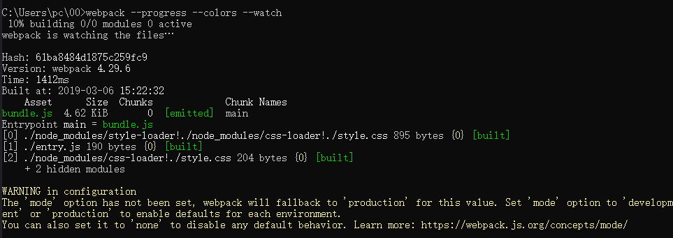

# Webpack安装

由 Shaodengdeng 创建，Alma 最后一次修改 2017-07-06

首先要安装 [Node.js](https://nodejs.org/en/download/)， Node.js 自带了软件包管理器 npm，Webpack 需要 Node.js v0.6 以上支持，建议使用最新版 Node.js。

用 npm 安装 Webpack：

```bash
$ npm install webpack -g
```

此时 Webpack 已经安装到了全局环境下，可以通过命令行 webpack -h 试试。

通常我们会将 Webpack 安装到项目的依赖中，这样就可以使用项目本地版本的 Webpack。

```bash
# 进入项目目录
# 确定已经有 package.json，没有就通过 npm init 创建
# 安装 webpack 依赖
$ npm install webpack --save-dev
```

Webpack 目前有两个主版本，一个是在 master 主干的稳定版，一个是在 webpack-2 分支的测试版，测试版拥有一些实验性功能并且和稳定版不兼容，在正式项目中应该使用稳定版。

```bash
# 查看 webpack 版本信息
$ npm info webpack

# 安装指定版本的 webpack
$ npm install webpack@1.12.x --save-dev
```

如果需要使用 Webpack 开发工具，要单独安装：

```bash
$ npm install webpack-dev-server --save-dev
```

# Webpack使用

由 Shaodengdeng 创建，Alma 最后一次修改 2017-07-06

首先创建一个静态页面 index.html 和一个 JS 入口文件 entry.js：

```html
<!-- index.html -->
<html>
<head>
  <meta charset="utf-8">
</head>
<body>
  <script src="bundle.js"></script>
</body>
</html>
// entry.js
document.write('It works.')
```

然后编译 entry.js 并打包到 bundle.js：

```bash
$ webpack entry.js bundle.js
已更改为
webpack entry.js -o bundle.js
```

打包过程会显示日志：

```bash
Hash: e964f90ec65eb2c29bb9
Version: webpack 1.12.2
Time: 54ms
    Asset     Size  Chunks             Chunk Names
bundle.js  1.42 kB       0  [emitted]  main
   [0] ./entry.js 27 bytes {0} [built]
```

用浏览器打开 index.html 将会看到 It works. 。

接下来添加一个模块 module.js 并修改入口 entry.js：

```javascript
// module.js
module.exports = 'It works from module.js.'
// entry.js
document.write('It works.')
document.write(require('./module.js')) // 添加模块
```

重新打包 webpack entry.js bundle.js 后刷新页面看到变化 It works.It works from module.js.

```bash
Hash: 279c7601d5d08396e751
Version: webpack 1.12.2
Time: 63ms
    Asset     Size  Chunks             Chunk Names
bundle.js  1.57 kB       0  [emitted]  main
   [0] ./entry.js 66 bytes {0} [built]
   [1] ./module.js 43 bytes {0} [built]
```

Webpack 会分析入口文件，解析包含依赖关系的各个文件。这些文件（模块）都打包到 bundle.js 。Webpack 会给每个模块分配一个唯一的 id 并通过这个 id 索引和访问模块。在页面启动时，会先执行 entry.js 中的代码，其它模块会在运行 require 的时候再执行。

# Webpack配置文件

由 Shaodengdeng 创建，Alma 最后一次修改 2017-07-06

Webpack 在执行的时候，除了在命令行传入参数，还可以通过指定的配置文件来执行。默认情况下，会搜索当前目录的 webpack.config.js 文件，这个文件是一个 node.js 模块，返回一个 json 格式的配置信息对象，或者通过 --config 选项来指定配置文件。

继续我们的案例，在根目录创建 package.json 来添加 webpack 需要的依赖：

```json
{
  "name": "webpack-example",
  "version": "1.0.0",
  "description": "A simple webpack example.",
  "main": "bundle.js",
  "scripts": {
    "test": "echo \"Error: no test specified\" && exit 1"
  },
  "keywords": [
    "webpack"
  ],
  "author": "zhaoda",
  "license": "MIT",
  "devDependencies": {
    "css-loader": "^0.21.0",
    "style-loader": "^0.13.0",
    "webpack": "^1.12.2"
  }
}
# 如果没有写入权限，请尝试如下代码更改权限
chflags -R nouchg .
sudo chmod  775 package.json
```

别忘了运行 npm install。

然后创建一个配置文件 webpack.config.js：

```javascript
var webpack = require('webpack')

module.exports = {
  entry: './entry.js',
  output: {
    path: __dirname,
    filename: 'bundle.js'
  },
  module: {
    loaders: [
      {test: /\.css$/, loader: 'style-loader!css-loader'}
    ]
  }
}
```

同时简化 entry.js 中的 style.css 加载方式：

```javascript
require('./style.css')
```

最后运行 webpack，可以看到 webpack 通过配置文件执行的结果和上一章节通过命令行 webpack entry.js bundle.js --module-bind 'css=style-loader!css-loader' 执行的结果是一样的。

## 报错解决方案

提示不识别的loaders，经查为webpack.config.js中的loaders过时，改为rules即可。


完成后编译，如下图


# Webpack插件

由 Shaodengdeng 创建，Alma 最后一次修改 2017-07-06

插件可以完成更多 loader 不能完成的功能。

插件的使用一般是在 webpack 的配置信息 plugins 选项中指定。

Webpack 本身内置了一些常用的插件，还可以通过 npm 安装第三方插件。

接下来，我们利用一个最简单的 BannerPlugin 内置插件来实践插件的配置和运行，这个插件的作用是给输出的文件头部添加注释信息。

修改 webpack.config.js，添加 plugins：

```javascript
var webpack = require('webpack')

module.exports = {
  entry: './entry.js',
  output: {
    path: __dirname,
    filename: 'bundle.js'
  },
  module: {
    loaders: [
      {test: /\.css$/, loader: 'style-loader!css-loader'}
    ]
  },
  plugins: [
    new webpack.BannerPlugin('This file is created by zhaoda')
  ]
}
```

然后运行 webpack，打开 bundle.js，可以看到文件头部出现了我们指定的注释信息：

```javascript
/*! This file is created by zhaoda */
/******/ (function(modules) { // webpackBootstrap
/******/  // The module cache
/******/  var installedModules = {};
// 后面代码省略
```

# Webpack开发环境

由 Shaodengdeng 创建，Alma 最后一次修改 2017-07-06

当项目逐渐变大，webpack 的编译时间会变长，可以通过参数让编译的输出内容带有进度和颜色。

```bash
$ webpack --progress --colors
```


如果不想每次修改模块后都重新编译，那么可以启动监听模式。开启监听模式后，没有变化的模块会在编译后缓存到内存中，而不会每次都被重新编译，所以监听模式的整体速度是很快的。

```bash
$ webpack --progress --colors --watch
```



当然，使用 webpack-dev-server 开发服务是一个更好的选择。它将在 localhost:8080 启动一个 express 静态资源 web 服务器，并且会以监听模式自动运行 webpack，在浏览器打开 <http://localhost:8080/> 或 <http://localhost:8080/webpack-dev-server/> 可以浏览项目中的页面和编译后的资源输出，并且通过一个 socket.io 服务实时监听它们的变化并自动刷新页面。

```bash
# 安装
$ npm install webpack-dev-server -g
# 运行
$ webpack-dev-server --progress --colors
```


## 故障处理

Webpack 的配置比较复杂，很容出现错误，下面是一些通常的故障处理手段。

一般情况下，webpack 如果出问题，会打印一些简单的错误信息，比如模块没有找到。我们还可以通过参数 --display-error-details 来打印错误详情。

Webpack 的配置提供了 resolve 和 resolveLoader 参数来设置模块解析的处理细节，resolve 用来配置应用层的模块（要被打包的模块）解析，resolveLoader 用来配置 loader 模块的解析。

当引入通过 npm 安装的 node.js 模块时，可能出现找不到依赖的错误。Node.js 模块的依赖解析算法很简单，是通过查看模块的每一层父目录中的 node_modules 文件夹来查询依赖的。当出现 Node.js 模块依赖查找失败的时候，可以尝试设置 resolve.fallback 和 resolveLoader.fallback 来解决问题。

```JavaScript
module.exports = {
  resolve: { fallback: path.join(__dirname, "node_modules") },
  resolveLoader: { fallback: path.join(__dirname, "node_modules") }
};
```

Webpack 中涉及路径配置最好使用绝对路径，建议通过 path.resolve(__dirname, "app/folder") 或 path.join(__dirname, "app", "folder") 的方式来配置，以兼容 Windows 环境。