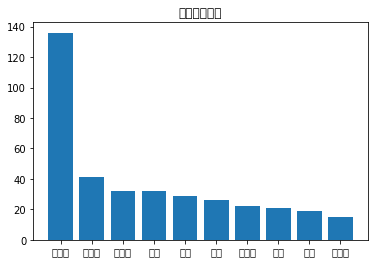

# 综合大作业

**第一步：爱奇艺《青春有你2》评论数据爬取**(参考链接：[https://www.iqiyi.com/v_19ryfkiv8w.html#curid=15068699100_9f9bab7e0d1e30c494622af777f4ba39](http://))

* 爬取任意一期正片视频下评论
* 评论条数不少于1000条

**第二步：词频统计并可视化展示**
* 数据预处理：清理清洗评论中特殊字符（如：@#￥%、emoji表情符）,清洗后结果存储为txt文档
* 中文分词：添加新增词（如：青你、奥利给、冲鸭），去除停用词（如：哦、因此、不然、也好、但是）
* 统计top10高频词
* 可视化展示高频词

**第三步：绘制词云**
* 根据词频生成词云
* 可选项-添加背景图片，根据背景图片轮廓生成词云 

**第四步：结合PaddleHub，对评论进行内容审核**


# 需要的配置和准备
* 中文分词需要jieba
* 词云绘制需要wordcloud
* 可视化展示中需要的中文字体
* 网上公开资源中找一个中文停用词表
* 根据分词结果自己制作新增词表
* 准备一张词云背景图（附加项，不做要求，可用hub抠图实现）
* paddlehub配置


```python
!pip install jieba
!pip install wordcloud
```

    Looking in indexes: https://pypi.mirrors.ustc.edu.cn/simple/
    Requirement already satisfied: jieba in /opt/conda/envs/python35-paddle120-env/lib/python3.7/site-packages (0.42.1)
    Looking in indexes: https://pypi.mirrors.ustc.edu.cn/simple/
    Collecting wordcloud
    [?25l  Downloading https://mirrors.tuna.tsinghua.edu.cn/pypi/web/packages/d6/af/55c7f2aa0997147943b474a74bab8deb17e7cf935b9abb8798d724c57721/wordcloud-1.6.0-cp37-cp37m-manylinux1_x86_64.whl (361kB)
         |████████████████████████████████| 368kB 9.8MB/s eta 0:00:01
    [?25hRequirement already satisfied: matplotlib in /opt/conda/envs/python35-paddle120-env/lib/python3.7/site-packages (from wordcloud) (2.2.3)
    Requirement already satisfied: pillow in /opt/conda/envs/python35-paddle120-env/lib/python3.7/site-packages (from wordcloud) (6.2.0)
    Requirement already satisfied: numpy>=1.6.1 in /opt/conda/envs/python35-paddle120-env/lib/python3.7/site-packages (from wordcloud) (1.16.4)
    Requirement already satisfied: python-dateutil>=2.1 in /opt/conda/envs/python35-paddle120-env/lib/python3.7/site-packages (from matplotlib->wordcloud) (2.8.0)
    Requirement already satisfied: pytz in /opt/conda/envs/python35-paddle120-env/lib/python3.7/site-packages (from matplotlib->wordcloud) (2019.3)
    Requirement already satisfied: pyparsing!=2.0.4,!=2.1.2,!=2.1.6,>=2.0.1 in /opt/conda/envs/python35-paddle120-env/lib/python3.7/site-packages (from matplotlib->wordcloud) (2.4.2)
    Requirement already satisfied: cycler>=0.10 in /opt/conda/envs/python35-paddle120-env/lib/python3.7/site-packages (from matplotlib->wordcloud) (0.10.0)
    Requirement already satisfied: six>=1.10 in /opt/conda/envs/python35-paddle120-env/lib/python3.7/site-packages (from matplotlib->wordcloud) (1.12.0)
    Requirement already satisfied: kiwisolver>=1.0.1 in /opt/conda/envs/python35-paddle120-env/lib/python3.7/site-packages (from matplotlib->wordcloud) (1.1.0)
    Requirement already satisfied: setuptools in /opt/conda/envs/python35-paddle120-env/lib/python3.7/site-packages (from kiwisolver>=1.0.1->matplotlib->wordcloud) (41.4.0)
    Installing collected packages: wordcloud
    Successfully installed wordcloud-1.6.0


```python

```


```python
# Linux系统默认字体文件路径
# !ls /usr/share/fonts/
# 查看系统可用的ttf格式中文字体
!fc-list :lang=zh | grep ".ttf"
```


```python
# !wget https://mydueros.cdn.bcebos.com/font/simhei.ttf # 下载中文字体
# #创建字体目录fonts
!mkdir .fonts
# # 复制字体文件到该路径
!cp simhei.ttf .fonts/
```


```python
#安装模型
!hub install porn_detection_lstm==1.1.0
!pip install --upgrade paddlehub
```

    Downloading porn_detection_lstm
    [==================================================] 100.00%
    Uncompress /home/aistudio/.paddlehub/tmp/tmpai7vxso2/porn_detection_lstm
    [==================================================] 100.00%
    Successfully installed porn_detection_lstm-1.1.0
    Looking in indexes: https://pypi.mirrors.ustc.edu.cn/simple/
    WARNING: Retrying (Retry(total=4, connect=None, read=None, redirect=None, status=None)) after connection broken by 'ReadTimeoutError("HTTPSConnectionPool(host='pypi.mirrors.ustc.edu.cn', port=443): Read timed out. (read timeout=15)")': /simple/paddlehub/
    Requirement already up-to-date: paddlehub in /opt/conda/envs/python35-paddle120-env/lib/python3.7/site-packages (1.6.1)
    Requirement already satisfied, skipping upgrade: colorlog in /opt/conda/envs/python35-paddle120-env/lib/python3.7/site-packages (from paddlehub) (4.1.0)
    Requirement already satisfied, skipping upgrade: pre-commit in /opt/conda/envs/python35-paddle120-env/lib/python3.7/site-packages (from paddlehub) (1.21.0)
    Requirement already satisfied, skipping upgrade: gunicorn>=19.10.0; sys_platform != "win32" in /opt/conda/envs/python35-paddle120-env/lib/python3.7/site-packages (from paddlehub) (20.0.4)
    Requirement already satisfied, skipping upgrade: protobuf>=3.6.0 in /opt/conda/envs/python35-paddle120-env/lib/python3.7/site-packages (from paddlehub) (3.10.0)
    Requirement already satisfied, skipping upgrade: pyyaml in /opt/conda/envs/python35-paddle120-env/lib/python3.7/site-packages (from paddlehub) (5.1.2)
    Requirement already satisfied, skipping upgrade: flask>=1.1.0 in /opt/conda/envs/python35-paddle120-env/lib/python3.7/site-packages (from paddlehub) (1.1.1)
    Requirement already satisfied, skipping upgrade: tb-paddle in /opt/conda/envs/python35-paddle120-env/lib/python3.7/site-packages (from paddlehub) (0.3.6)
    Requirement already satisfied, skipping upgrade: cma==2.7.0 in /opt/conda/envs/python35-paddle120-env/lib/python3.7/site-packages (from paddlehub) (2.7.0)
    Requirement already satisfied, skipping upgrade: chardet==3.0.4 in /opt/conda/envs/python35-paddle120-env/lib/python3.7/site-packages (from paddlehub) (3.0.4)
    Requirement already satisfied, skipping upgrade: flake8 in /opt/conda/envs/python35-paddle120-env/lib/python3.7/site-packages (from paddlehub) (3.7.9)
    Requirement already satisfied, skipping upgrade: six>=1.10.0 in /opt/conda/envs/python35-paddle120-env/lib/python3.7/site-packages (from paddlehub) (1.12.0)
    Requirement already satisfied, skipping upgrade: sentencepiece in /opt/conda/envs/python35-paddle120-env/lib/python3.7/site-packages (from paddlehub) (0.1.85)
    Requirement already satisfied, skipping upgrade: Pillow in /opt/conda/envs/python35-paddle120-env/lib/python3.7/site-packages (from paddlehub) (6.2.0)
    Requirement already satisfied, skipping upgrade: yapf==0.26.0 in /opt/conda/envs/python35-paddle120-env/lib/python3.7/site-packages (from paddlehub) (0.26.0)
    Requirement already satisfied, skipping upgrade: tensorboard>=1.15 in /opt/conda/envs/python35-paddle120-env/lib/python3.7/site-packages (from paddlehub) (2.1.0)
    Requirement already satisfied, skipping upgrade: opencv-python in /opt/conda/envs/python35-paddle120-env/lib/python3.7/site-packages (from paddlehub) (4.1.1.26)
    Requirement already satisfied, skipping upgrade: numpy; python_version >= "3" in /opt/conda/envs/python35-paddle120-env/lib/python3.7/site-packages (from paddlehub) (1.16.4)
    Requirement already satisfied, skipping upgrade: requests in /opt/conda/envs/python35-paddle120-env/lib/python3.7/site-packages (from paddlehub) (2.22.0)
    Requirement already satisfied, skipping upgrade: pandas; python_version >= "3" in /opt/conda/envs/python35-paddle120-env/lib/python3.7/site-packages (from paddlehub) (0.23.4)
    Requirement already satisfied, skipping upgrade: nltk in /opt/conda/envs/python35-paddle120-env/lib/python3.7/site-packages (from paddlehub) (3.4.5)
    Requirement already satisfied, skipping upgrade: cfgv>=2.0.0 in /opt/conda/envs/python35-paddle120-env/lib/python3.7/site-packages (from pre-commit->paddlehub) (2.0.1)
    Requirement already satisfied, skipping upgrade: nodeenv>=0.11.1 in /opt/conda/envs/python35-paddle120-env/lib/python3.7/site-packages (from pre-commit->paddlehub) (1.3.4)
    Requirement already satisfied, skipping upgrade: virtualenv>=15.2 in /opt/conda/envs/python35-paddle120-env/lib/python3.7/site-packages (from pre-commit->paddlehub) (16.7.9)
    Requirement already satisfied, skipping upgrade: identify>=1.0.0 in /opt/conda/envs/python35-paddle120-env/lib/python3.7/site-packages (from pre-commit->paddlehub) (1.4.10)
    Requirement already satisfied, skipping upgrade: toml in /opt/conda/envs/python35-paddle120-env/lib/python3.7/site-packages (from pre-commit->paddlehub) (0.10.0)
    Requirement already satisfied, skipping upgrade: aspy.yaml in /opt/conda/envs/python35-paddle120-env/lib/python3.7/site-packages (from pre-commit->paddlehub) (1.3.0)
    Requirement already satisfied, skipping upgrade: importlib-metadata; python_version < "3.8" in /opt/conda/envs/python35-paddle120-env/lib/python3.7/site-packages (from pre-commit->paddlehub) (0.23)
    Requirement already satisfied, skipping upgrade: setuptools>=3.0 in /opt/conda/envs/python35-paddle120-env/lib/python3.7/site-packages (from gunicorn>=19.10.0; sys_platform != "win32"->paddlehub) (41.4.0)
    Requirement already satisfied, skipping upgrade: click>=5.1 in /opt/conda/envs/python35-paddle120-env/lib/python3.7/site-packages (from flask>=1.1.0->paddlehub) (7.0)
    Requirement already satisfied, skipping upgrade: Jinja2>=2.10.1 in /opt/conda/envs/python35-paddle120-env/lib/python3.7/site-packages (from flask>=1.1.0->paddlehub) (2.10.1)
    Requirement already satisfied, skipping upgrade: Werkzeug>=0.15 in /opt/conda/envs/python35-paddle120-env/lib/python3.7/site-packages (from flask>=1.1.0->paddlehub) (0.16.0)
    Requirement already satisfied, skipping upgrade: itsdangerous>=0.24 in /opt/conda/envs/python35-paddle120-env/lib/python3.7/site-packages (from flask>=1.1.0->paddlehub) (1.1.0)
    Requirement already satisfied, skipping upgrade: moviepy in /opt/conda/envs/python35-paddle120-env/lib/python3.7/site-packages (from tb-paddle->paddlehub) (1.0.1)
    Requirement already satisfied, skipping upgrade: mccabe<0.7.0,>=0.6.0 in /opt/conda/envs/python35-paddle120-env/lib/python3.7/site-packages (from flake8->paddlehub) (0.6.1)
    Requirement already satisfied, skipping upgrade: entrypoints<0.4.0,>=0.3.0 in /opt/conda/envs/python35-paddle120-env/lib/python3.7/site-packages (from flake8->paddlehub) (0.3)
    Requirement already satisfied, skipping upgrade: pyflakes<2.2.0,>=2.1.0 in /opt/conda/envs/python35-paddle120-env/lib/python3.7/site-packages (from flake8->paddlehub) (2.1.1)
    Requirement already satisfied, skipping upgrade: pycodestyle<2.6.0,>=2.5.0 in /opt/conda/envs/python35-paddle120-env/lib/python3.7/site-packages (from flake8->paddlehub) (2.5.0)
    Requirement already satisfied, skipping upgrade: absl-py>=0.4 in /opt/conda/envs/python35-paddle120-env/lib/python3.7/site-packages (from tensorboard>=1.15->paddlehub) (0.8.1)
    Requirement already satisfied, skipping upgrade: google-auth<2,>=1.6.3 in /opt/conda/envs/python35-paddle120-env/lib/python3.7/site-packages (from tensorboard>=1.15->paddlehub) (1.10.0)
    Requirement already satisfied, skipping upgrade: wheel>=0.26; python_version >= "3" in /opt/conda/envs/python35-paddle120-env/lib/python3.7/site-packages (from tensorboard>=1.15->paddlehub) (0.33.6)
    Requirement already satisfied, skipping upgrade: google-auth-oauthlib<0.5,>=0.4.1 in /opt/conda/envs/python35-paddle120-env/lib/python3.7/site-packages (from tensorboard>=1.15->paddlehub) (0.4.1)
    Requirement already satisfied, skipping upgrade: markdown>=2.6.8 in /opt/conda/envs/python35-paddle120-env/lib/python3.7/site-packages (from tensorboard>=1.15->paddlehub) (3.1.1)
    Requirement already satisfied, skipping upgrade: grpcio>=1.24.3 in /opt/conda/envs/python35-paddle120-env/lib/python3.7/site-packages (from tensorboard>=1.15->paddlehub) (1.26.0)
    Requirement already satisfied, skipping upgrade: idna<2.9,>=2.5 in /opt/conda/envs/python35-paddle120-env/lib/python3.7/site-packages (from requests->paddlehub) (2.8)
    Requirement already satisfied, skipping upgrade: urllib3!=1.25.0,!=1.25.1,<1.26,>=1.21.1 in /opt/conda/envs/python35-paddle120-env/lib/python3.7/site-packages (from requests->paddlehub) (1.25.6)
    Requirement already satisfied, skipping upgrade: certifi>=2017.4.17 in /opt/conda/envs/python35-paddle120-env/lib/python3.7/site-packages (from requests->paddlehub) (2019.9.11)
    Requirement already satisfied, skipping upgrade: python-dateutil>=2.5.0 in /opt/conda/envs/python35-paddle120-env/lib/python3.7/site-packages (from pandas; python_version >= "3"->paddlehub) (2.8.0)
    Requirement already satisfied, skipping upgrade: pytz>=2011k in /opt/conda/envs/python35-paddle120-env/lib/python3.7/site-packages (from pandas; python_version >= "3"->paddlehub) (2019.3)
    Requirement already satisfied, skipping upgrade: zipp>=0.5 in /opt/conda/envs/python35-paddle120-env/lib/python3.7/site-packages (from importlib-metadata; python_version < "3.8"->pre-commit->paddlehub) (0.6.0)
    Requirement already satisfied, skipping upgrade: MarkupSafe>=0.23 in /opt/conda/envs/python35-paddle120-env/lib/python3.7/site-packages (from Jinja2>=2.10.1->flask>=1.1.0->paddlehub) (1.1.1)
    Requirement already satisfied, skipping upgrade: tqdm<5.0,>=4.11.2 in /opt/conda/envs/python35-paddle120-env/lib/python3.7/site-packages (from moviepy->tb-paddle->paddlehub) (4.36.1)
    Requirement already satisfied, skipping upgrade: imageio<3.0,>=2.5; python_version >= "3.4" in /opt/conda/envs/python35-paddle120-env/lib/python3.7/site-packages (from moviepy->tb-paddle->paddlehub) (2.6.1)
    Requirement already satisfied, skipping upgrade: imageio-ffmpeg>=0.2.0; python_version >= "3.4" in /opt/conda/envs/python35-paddle120-env/lib/python3.7/site-packages (from moviepy->tb-paddle->paddlehub) (0.3.0)
    Requirement already satisfied, skipping upgrade: proglog<=1.0.0 in /opt/conda/envs/python35-paddle120-env/lib/python3.7/site-packages (from moviepy->tb-paddle->paddlehub) (0.1.9)
    Requirement already satisfied, skipping upgrade: decorator<5.0,>=4.0.2 in /opt/conda/envs/python35-paddle120-env/lib/python3.7/site-packages (from moviepy->tb-paddle->paddlehub) (4.4.0)
    Requirement already satisfied, skipping upgrade: cachetools<5.0,>=2.0.0 in /opt/conda/envs/python35-paddle120-env/lib/python3.7/site-packages (from google-auth<2,>=1.6.3->tensorboard>=1.15->paddlehub) (4.0.0)
    Requirement already satisfied, skipping upgrade: pyasn1-modules>=0.2.1 in /opt/conda/envs/python35-paddle120-env/lib/python3.7/site-packages (from google-auth<2,>=1.6.3->tensorboard>=1.15->paddlehub) (0.2.7)
    Requirement already satisfied, skipping upgrade: rsa<4.1,>=3.1.4 in /opt/conda/envs/python35-paddle120-env/lib/python3.7/site-packages (from google-auth<2,>=1.6.3->tensorboard>=1.15->paddlehub) (4.0)
    Requirement already satisfied, skipping upgrade: requests-oauthlib>=0.7.0 in /opt/conda/envs/python35-paddle120-env/lib/python3.7/site-packages (from google-auth-oauthlib<0.5,>=0.4.1->tensorboard>=1.15->paddlehub) (1.3.0)
    Requirement already satisfied, skipping upgrade: more-itertools in /opt/conda/envs/python35-paddle120-env/lib/python3.7/site-packages (from zipp>=0.5->importlib-metadata; python_version < "3.8"->pre-commit->paddlehub) (7.2.0)
    Requirement already satisfied, skipping upgrade: pyasn1<0.5.0,>=0.4.6 in /opt/conda/envs/python35-paddle120-env/lib/python3.7/site-packages (from pyasn1-modules>=0.2.1->google-auth<2,>=1.6.3->tensorboard>=1.15->paddlehub) (0.4.8)
    Requirement already satisfied, skipping upgrade: oauthlib>=3.0.0 in /opt/conda/envs/python35-paddle120-env/lib/python3.7/site-packages (from requests-oauthlib>=0.7.0->google-auth-oauthlib<0.5,>=0.4.1->tensorboard>=1.15->paddlehub) (3.1.0)


```python
from __future__ import print_function
import requests
import json
import re #正则匹配
import time #时间处理模块
import jieba #中文分词
import numpy as np
import matplotlib
import matplotlib.pyplot as plt
import matplotlib.font_manager as font_manager
from PIL import Image
from wordcloud import WordCloud  #绘制词云模块
import paddlehub as hub
```


```python


# 获取接口    
def getMoveinfo(url):
    session = requests.Session()
    headers = {
        "User-Agent": "Mozilla/5.0 (iPhone; CPU iPhone OS 11_0 like Mac OS X) AppleWebKit/604.1.38 (KHTML, like Gecko) Version/11.0 Mobile/15A372 Safari/604.1",
        "Accept": "application/json",
        "Referer": "http://m.iqiyi.com/v_19rqriflzg.html",
        "Origin": "http://m.iqiyi.com",
        "Host": "sns-comment.iqiyi.com",
        "Connection": "keep-alive",
        "Accept-Language": "en-US,en;q=0.9,zh-CN;q=0.8,zh;q=0.7,zh-TW;q=0.6",
        "Accept-Encoding": "gzip, deflate"
    }
    response = session.get(url, headers=headers)
    if response.status_code == 200:
        return response.text
    return None


def saveMovieInfoToFile(lastId, arr):
    url='https://sns-comment.iqiyi.com/v3/comment/get_comments.action?agent_type=118&agent_version=9.11.5&authcookie=null&business_type=17&content_id=15068699100&page=&page_size=10&types=time&last_id='
    url+=str(lastId)
    responseTxt = getMoveinfo(url)
    responseJson=json.loads(responseTxt)
    comments=responseJson['data']['comments']
    for val in comments:
        # print(val.keys())
        if 'content' in val.keys():
            print(val['content'])
            arr.append(val['content'])
        lastId = str(val['id'])
    return lastId
```


```python
#去除文本中特殊字符

def clear_special_char(content):
    '''
    正则处理特殊字符
    参数 content:原文本
    return: 清除后的文本
    '''
    comp = re.compile('[^A-Z^a-z^0-9^\u4e00-\u9fa5]')
    return comp.sub('', content)

# text_zh = '$你好！我是个程序猿，标注码农￥'
# print(clear_special_char(text_zh))
```


```python
def fenci(text):
    '''
    利用jieba进行分词
    参数 text:需要分词的句子或文本
    return：分词结果
    '''
    # 添加自定义字典 add_words.txt
    # jieba.load_userdict('') 
    seg=jieba.lcut(text)
    return seg
    
     

```


```python
def stopwordslist(file_path):
    '''
    创建停用词表
    参数 file_path:停用词文本路径
    return：停用词list
    '''
    # f= open(file_path, 'r') 
    # my_data = [i.strip('\n') for i in f]

    stopwords= [line.strip() for line in open(file_path,encoding='UTF-8').readline()]
    return stopwords

# file_path=r'/home/aistudio/stopwords/中文停用词表.txt'
# list=stopwordslist(file_path)
# print(list)

```


```python
def movestopwords(sentence, stopwords, counts):
    '''
    去除停用词,统计词频
    参数 file_path:停用词文本路径 stopwords:停用词list counts: 词频统计结果
    return：None
    '''
    # out=[]
    for word in sentence:
        if word not in stopwords:
            if len(word) !=1:
                counts[word]=counts.get(word,0)+1
    return None

   
```


```python
def drawcounts(counts, num):
    '''
    绘制词频统计表
    参数 counts: 词频统计结果 num:绘制topN
    return：none
    '''
    x_aixs=[]
    y_aixs=[]
    c_order=sorted(counts.items(), key=lambda x:x[1],reverse=True)
    for c in c_order[:num]:
        x_aixs.append(c[0])
        y_aixs.append(c[1])
    
    matplotlib.rcParams['font.sans-serif']=['SimHei']
    matplotlib.rcParams['axes.unicode_minus']=False
    plt.bar(x_aixs, y_aixs)
    plt.title('词频统计结果')
    plt.show()

```


```python
def drawcloud(word_f):
    '''
    根据词频绘制词云图
    参数 word_f:统计出的词频结果
    return：none
    '''    
    cloud_mask=np.array(Image.open('cloud.jpg'))
    st=set(['东西', '这是'])
    wc=WordCloud(background_color='white',
    mask=cloud_mask,
    max_words=150,
    font_path='simhei.ttf',
    min_font_size=10,
    max_font_size=100,
    width=400,
    relative_scaling=0.3,
    stopwords=st)
    wc.fit_words(word_f)
    wc.to_file('pic.png')
```


```python
def text_detection(text, file_path):
    '''
    使用hub对评论进行内容分析
    return：分析结果

    '''
    porn_detection_lstm=hub.Module(name='porn_detection_lstm')
    f=open('aqy.txt', 'r', encoding='utf-8')
    for line in f:
        if len(line.strip())==1:
            continue
        else:
            test_text.append(line)
    f.close()

    input_dict={'text':test_text}
    results=porn_detection_lstm.detection(data=input_dict,use_gpu=True,batch_size=1)
    for index, item in enumerate(results):
        if item['porn_detection_key'] =='porn':
            print(item['text'],':', item['porn_probs'])


```


```python
#评论是多分页的，得多次请求爱奇艺的评论接口才能获取多页评论,有些评论含有表情、特殊字符之类的
#num 是页数，一页10条评论，假如爬取1000条评论，设置num=100
## 转换数据
if __name__ == '__main__':
    num=20
    lastId='0'
    arr=[]
    with open('aqy.txt', 'a', encoding='utf-8') as f:
        for i in range(num):
            lastId=saveMovieInfoToFile(lastId, arr)
            time.sleep(0.5)
        for item in arr:
            item=clear_special_char(item)
            if item.strip()!='':
                try:
                    f.write(item+'\n')
                except  e:
                    print('含有特殊字符')
    print("共获取评论：", len(arr))
    f=open('aqy.txt', 'r', encoding='utf-8')
    counts={}
    for line in f:
        words=fenci(line)
        stopwords=stopwordslist(r'./stopwords/中文停用词表.txt')
        movestopwords(words, stopwords, counts)
    drawcounts(counts, 10)
    drawcloud(counts)
    f.close()

    file_path='aqy.txt'
    test_text=[]
    text_detection(test_text, file_path)


```

    啊啊啊啊啊啊啊啊啊啊啊乃万冲冲冲
    金子
    让我康下我昕姐的粉在哪里吖 刘总真的太🉑️了 好爱好爱[色]
    陈珏的音色真的又特别又深得我心！
    谢可寅，安琦，虞书欣，金子涵金子涵金子涵！！！！！🍃🍃🍃
    刘雨欣刘雨欣刘雨欣刘雨欣刘雨欣刘雨欣刘雨欣刘雨欣刘雨欣刘雨欣刘雨欣刘雨欣刘雨欣刘雨欣刘雨欣刘雨欣刘雨欣刘雨欣刘雨欣
    啊啊啊啊妈妈爱你嗷嗷嗷嗷嗷～么么哒[亲亲][亲亲][亲亲][亲亲]加油喔！！！！！
    刘雨昕刘雨昕刘雨昕刘雨昕刘雨昕刘雨昕刘雨昕刘雨昕刘雨昕刘雨昕刘雨昕刘雨昕刘雨昕刘雨昕刘雨昕
    虞书欣冲冲冲[微笑]
    冲啊许佳琪！
    王承渲，加油!
    搞不懂虞书欣有什么资格得第一。。。
    喜欢寅
    许佳琪冲啊！
    刘雨昕我好爱他
    刘雨昕最棒
    刘雨昕
    乃万冲冲冲！！
    乃万！
    3A女王才第四？！[流汗]什么鬼
    安琦真的值得最好的，舞台爆发力超级强，配得上第一[害羞]
    安崎真的怎么可能不进前三，我哭，她配得上最好的，第一第一[色]出道第一，必须出道
    我也叫孙芮
    怎么会没有葛鑫怡[流泪][流泪][流泪]
    许佳琪 孔雪儿高位出道吧
    其实虞书欣真的很棒，每次都是第一名
    投虞书欣，孔雪儿，赵小棠，她们值得
    虞书欣一直在背后努力证明自己，证明她可以坐在c位
    刘雨昕冲冲冲！
    真的喜欢这些香香的女孩子呀[色]
    赵小棠！！！我pick她！！！太棒啦呜呜呜呜呜呜呜呜呜呜呜呜呜呜呜
    刘雨昕加油
    最近准备写一篇关于喷子的论文，从其家庭背景，生活习惯，社交，与年纪，各个方面来进行简述，大家支持我一下好吗
    谢可寅最棒了
    冲鸭！加油[亲亲]
    这个第一怎么选的，太失望了，又作又没实力[冷汗][冷汗][冷汗]我也是醉了！
    为什么后期没见到申家四姐妹？
    kiki加油相信你自己,你要相信自己是最棒的!
    欣欣好可爱，我爱死你了！
    我投票给了虞书欣 赵小棠 王承渲 蔡卓宜 朱林雨 戴萌 胡馨尹 孔雪儿 秦牛正威牛姐
    谢可寅给妈妈冲呀！！！
    欣欣子加油你是最棒的小石榴们一直在你身后支持你所有人都以为你很容易但你说对了自己吃过的苦只有自己知道
    Pick虞书欣书欣书欣书欣书欣书欣书欣书欣书欣书欣书欣书欣书欣书欣书欣书欣
    欣欣我们都会支持你哦，加油加油♡ 爱你么么哒
    虞书欣加油！
    书欣书欣书欣书欣书欣书欣爱你爱你爱你
    欣欣子加油＾０＾~
    虞书欣虞书欣虞书欣虞书欣虞书欣
    书欣宝贝😊
    虞书欣虞书欣虞书欣虞书欣虞书欣虞书欣虞书欣虞书欣虞书欣虞书欣虞书欣虞书欣虞书欣虞书欣虞书欣虞书欣虞书欣虞书欣虞书欣虞书欣虞书欣虞书欣虞书欣虞书欣虞书欣虞书欣虞书欣虞书欣虞书欣虞书欣虞书欣虞书欣虞书欣虞书欣虞书欣虞书欣虞书欣虞书欣虞书欣虞书欣虞书欣虞书欣虞书欣虞书欣虞书欣虞书欣虞书欣虞书欣虞书欣虞书欣虞书欣虞书欣虞书欣虞书欣虞书欣虞书欣虞书欣虞书欣虞书欣虞书欣虞书欣虞书欣虞书欣虞书欣虞书欣虞书欣虞书欣虞书欣虞书欣虞书欣虞书欣虞书欣虞书欣虞书欣虞书欣虞书欣虞书欣虞书欣虞书欣虞书欣虞书欣虞书欣虞书欣虞书欣虞书欣虞书欣虞书欣虞书欣虞书欣虞书欣虞书欣虞书欣虞书欣虞书欣虞书欣虞书欣虞书欣虞书欣虞书欣虞书欣虞书欣虞书欣虞书欣虞书欣虞书欣虞书欣虞书欣虞书欣虞书欣虞书欣虞书欣虞书欣虞书欣虞书欣虞书欣虞书欣虞书欣虞书欣虞书欣虞书欣虞书欣虞书欣虞书欣虞书欣虞书欣虞书欣虞书欣虞书欣虞书欣虞书欣虞书欣虞书欣虞书欣虞书欣虞书欣。l like you♡
    请大家投给书欣一票吧🙏🙏🙏🙏
    虞书欣胖了[呲牙]支持
    喻言冲呀
    这个牛奶真难喝，还没有真果粒好喝
    难喝
    难喝
    难喝
    刘雨欣
    勾√小姐姐的vocal真不错
    金子涵冲冲冲
    刘雨昕
    刘雨昕
    有6票未投，帮我投宋昭艺好吗
    刘雨昕超级棒的全能刘雨昕  加油  越努力越幸运
    刘雨昕！！
    刘雨欣很棒
    欣欣加油♥
    很喜欢刘雨昕 真的有颜值又有实力，期待小姐姐，和我们一起走花路叭
    虞书欣
    刘雨昕，你每次舞台都给人不同的惊喜，太喜欢你了，十年的坚持，希望你的梦想成真！
    我还有9票，谁需要
    [微笑][微笑][微笑]
    文哲这么棒啊
    姐妹们，康康NINEONE吧！ 
    91差一点点就进前九了， 
    请大家手里如果有多余票的， 
    投给乃万一票吧，蟹蟹🙏
    [色]
    想看Lisa
    虞书欣加油！[亲亲]
    16票 有需要投的嘛
    虞书欣
    虞书欣
    虞书欣冲
    秦牛正威
    孔雪儿！孔雪儿！
    我发现有些人就是bb虞美人不配，就你能，就你最配！你行你上啊！不说好不好人家起码会唱会跳，当时杨超越都不那么会也照样有人爱看，观众缘懂不懂，制作人懂不懂，不就是让观众自己选自己喜欢的，要什么都完美的人家就直接找几个评委来评个等级了，作为艺人你再好没人看有什么意思？！！
    喻言喻言冲冲冲
    葛鑫怡冲啊
    Pick虞书欣书欣书欣书欣书欣书欣书欣书欣书欣书欣书欣书欣书欣书欣书欣书欣
    虞书欣加油加油加油
    虞书欣冲鸭！
    虞书欣
    虞书欣
    乃万啊啊啊啊冲呀
    蔡徐坤:许佳琪可以哟
    这辈子只爱许佳琪
    许佳琪，神仙妹妹，你知道
    许佳琪，我爱你
    不是我说假，许佳琪要是上不了热一前三，我倒立洗头
    许佳琪真的太棒了
    有没有姐妹可以帮王承渲投票，真心地谢谢每一个可以帮她投票的人，真的谢谢你们！
    虞书欣 赵小棠 安崎 谢可寅 金子涵 葛鑫怡冲冲冲！！！
    许佳琪小姐姐跳舞超级好的啊我好爱啊啊啊
    大鱼海棠顶配绝配第一配。
    大虞海棠大虞海棠大虞海棠[害羞]
    来晚了
    刘雨昕！
    我只投得一个票，还有八个票可投。有没有需要帮人投的
    虞书欣冲冲
    虞书欣，我觉得你是最棒的，我很喜欢你，希望你继续加油不管是拍戏还是表演都可以开开心心的我会一直支持你
    安崎姐姐的“当然”真的令人着迷好吗
    评论里都唠美女，就让我来挺张总
    张总的妆发是怎么了？？？害张总唱歌真的很好听，嗓音绝了，连唱戏腔都超有内味，大家多看看这个有实力的张张总吧！
    虞书欣给我说哭了，刚开始挺不喜欢她的，后面反而觉得挺可爱的，开心的人有时候并没有看起来那么快乐
    今年最喜欢的只有刘雨昕了！！！雨昕加油！！！渲渲也很棒，有实力！！！！
    今年最喜欢的只有刘雨昕了！！！雨昕加油！！！
    喻言，刘雨欣，曾可妮，谢可寅，刘令姿，许佳琪。这几个比较适合[色][色]
    安崎 最棒，
    kiki do you love me 我终于找到KIKI了
    唯一人选，金子涵！
    卓宜冲鸭
    求求大家看看hhby的徐紫茵吧[快哭了]
    许佳琪我意难平啊才第七
    小宅冲啊！！！
    我特别喜欢虞书欣 也就是为了她来看这个节目的，对 你们是觉得她实力不够，但有我们宠着！你们不喜欢她可以不看！但请不要黑她，她也是人也会伤心的。有时候自己还伤心着呢却还想着安慰别人，我真的太爱欣欣了！
    请投给陈珏谢谢谢谢谢谢谢谢
    雪儿雪儿雪儿最棒
    许佳琪！
    加油
    我的赵小棠呢
    我真的爱了！许佳琪非常的温柔，包容，亲切。她待人真诚，没有架子，从来都是以真心换真心。变得越来越好了。
    觉得许馨文已经是一个成熟歌手的水平 ，好多风格的曲目都能hold住 加油冲鸭 从现在开始发光 ！期待着你！​
    哈哈哈
    在这一期节目当中，真的是看青春有你这一节目都会笑的，感觉已经养成了习惯了。
    我的曾可妮和喻言太粉了，感觉就像班里的女班长和男班长，一路走来，进步太大了。
    大虞海棠真的是看别人都这么开心的，那看自己不更加开心了嘛，而且还说有意思的话呢，她们两个简直是我的开心果呢。
    谢可寅！！
    安崎，喻言，孔雪儿，金子涵必须出道啊啊啊啊啊啊啊啊啊啊啊啊
    我这么多年一直坚持喜欢许佳琪，她是我们的星星，我们在她的眼里也都闪闪发光。陪她一起成长。
    谢可寅，安琪，孔雪儿，王承渲，还挺喜欢她们的
    孔雪儿有点像张嘉倪，又有像唐嫣
    虞书欣真的是太顽皮了，竟然能说出谁比她丑就坐在旁边，毫不疑问肯定是坐在赵小棠旁边了，真的给我们快乐啊。
    青春有你2乃万💚🍼  实力rapper乃万💚🍼 原创歌手乃万💚  🍼 可盐可甜乃万💚🍼  可奶可酷乃万💚🍼 美貌杀人乃万💚🍼  绝美嗓音乃万💚 🍼心动狙击乃万💚 🍼  魅力爆表乃万💚 🍼 舞台王者乃万💚
    你看到这一期之后，就知道虞书欣的造型是多么的好笑呢，这会让人家的心情会变得好起来哟。
    那个说只有你一个人不喜欢陈珏的，告诉你只有你一个人。
    刘雨昕小姐姐
    你是最棒的呦!!!
    哈哈
    演员
    如果排名全部都只算制作人的助力值，那分班的作用气势不大
    上官呢
    大虞海棠真的是给我们带来了很多的快乐呢。比如人家哭的时候，她就说别哭了哟，而且还摆了造型，讨人家可爱呢。
    戴燕妮，金子涵，戴燕妮，金子涵，戴燕妮。金子涵
    戴燕妮戴燕妮，金子涵金子涵，戴燕妮戴燕妮，金子涵金子涵，戴燕妮金子涵戴燕妮金子涵，戴燕妮金子涵，戴燕妮金子涵
    戴燕妮姐姐戴燕妮姐姐我爱你我爱你
    戴燕妮姐姐
    喻言冲鸭!
    别在这里说青你学员差好吗，去看看创造营的那帮孩子吧，要多没实力多没实力👀
    [呲牙][呲牙][呲牙][呲牙]
    那个爆炸头好丑。[得意][得意][得意][得意][得意]
    你的包扎头好丑哦
    永远支持大鱼海棠
    虞书欣
    真的，喻言真的好像一个男班，稳住方向、活跃氛围。经常说点逗比话让大家情绪积极一点，看着她们真好！
    看起来很高冷的可妮，私底下其实是关心队友，愿意把外套分给别人穿的女孩，一路走来，看着她们成长。
    虞书欣的眨眨眼果然是很撩人啊，竟然把赵小棠都撩了，然后就帮她拧盖了，她们两个说话还有意思啊。
    虞书欣说话还真的太有魔性了，竟然宁瓶盖都这么可爱，真的是把我给笑哭了呢。
    乃万加油
    来看一下这一期吧，真的是给人家的快乐的，如果你不开心的话，那就快带你来看哟。
    赵小棠还蛮有意思的啊，看到虞书欣就说了一个张三丰，蛮搞笑的，都不知道张三丰这个称号是怎么得来的呢？
    欣欣你最棒
    要笑死谁虞书欣
    许馨文真的是我看着变好的！唱歌实力真的强，她看上去憨憨的，希望她越走越好吧！
    虞书欣❤️
    刘雨昕
    嗯？
    刘雨昕刘雨昕刘雨昕[抓狂][抓狂][抓狂]
    今天的怎么没看见
    她们的努力与懈怠、前进与落后、优点与缺陷，都理应被共同正视。加油吧！
    刘雨昕给我冲！！！！！！！
    9.23分了
    蔡PD我来了
    蔡徐坤
    我想看虞书欣，关键时刻咋还没更新呢[流泪]......慢慢等待
    虞书欣你很好，你真实，做好你自己加油
    今天为什么没有更新
    今天怎么回事，不是8点正播放吗？现在都8点18了怎么回事？
    我的宝藏女孩啊！！许馨文终于要被发现了嘛！看着她从八十几到五十几到现在的29，我真的太骄傲了。
    刘雨昕刘雨昕刘雨昕刘雨昕
    13期怎么还没放 ，迟到了？
    喜欢她的乐观勇敢 可爱 不喜欢的人会觉得作 别的节目也有不喜欢她的时候 至少这里可以
    虞书欣这期第一吗
    你们要加油，还是那句话，这你弟的那个人都会有糖吃。[微笑]
    刘雨昕，加油
    .
    这个排名是来搞笑的吧！
    你一票我一票，书欣明天就出道
    都喜欢，反而不知道该投谁了～有人要给点建议吗？～[微笑]
    坤坤好暖
    谢可寅加油喔！希望你下次可以进前三！
    好喜欢谢可迎
    大家喜欢SNH48吗？（我个人很喜欢！）
    欢迎评论！！！
    虞书欣加油不要在意别人的评论
    虞书欣！！！欣欣子冲啊！！！
    蔡徐坤好帅
    虞书欣加油


    Building prefix dict from the default dictionary ...
    2020-04-27 22:52:09,383-DEBUG: Building prefix dict from the default dictionary ...


    共获取评论： 199


    Dumping model to file cache /tmp/jieba.cache
    2020-04-27 22:52:10,142-DEBUG: Dumping model to file cache /tmp/jieba.cache
    Loading model cost 0.830 seconds.
    2020-04-27 22:52:10,214-DEBUG: Loading model cost 0.830 seconds.
    Prefix dict has been built successfully.
    2020-04-27 22:52:10,216-DEBUG: Prefix dict has been built successfully.
    /opt/conda/envs/python35-paddle120-env/lib/python3.7/site-packages/matplotlib/font_manager.py:1331: UserWarning: findfont: Font family ['sans-serif'] not found. Falling back to DejaVu Sans
      (prop.get_family(), self.defaultFamily[fontext]))





    [2020-04-27 22:52:10,744] [    INFO] - Installing porn_detection_lstm module
    [2020-04-27 22:52:10,809] [    INFO] - Module porn_detection_lstm already installed in /home/aistudio/.paddlehub/modules/porn_detection_lstm


    让我康下我昕姐的粉在哪里吖刘总真的太了好爱好爱色
     : 0.7552
    刘雨欣刘雨欣刘雨欣刘雨欣刘雨欣刘雨欣刘雨欣刘雨欣刘雨欣刘雨欣刘雨欣刘雨欣刘雨欣刘雨欣刘雨欣刘雨欣刘雨欣刘雨欣刘雨欣啊啊啊啊妈妈爱你嗷嗷嗷嗷嗷么么哒亲亲亲亲亲亲亲亲加油喔
     : 0.8556
    喻言刘雨欣曾可妮谢可寅刘令姿许佳琪这几个比较适合色色
     : 0.9986


```python
display(Image.open('pic.png')) #显示生成的词云图像
```


